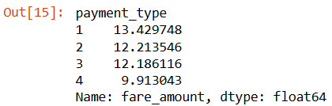

# OVERVIEW:
Little did I know that Statistics is the backbone in data 😅 In this end-of-course project, I tackled 2 different case studies using Python and basic Stats to solve:
- *Case Study 1:* **Automatidata,** a fictional data consulting firm
- *Case Study 2:* **TikTok,** a short-form video hosting firm

# Case Study 1: Automatidata 🚕
- **Link here:** [Case_study_1: Automatidata](https://github.com/amy941/Google_Advanced_Module-4_Statistics/blob/main/Case_study_1_Automatidata.ipynb)
- **What I Learned:**
  1) Compute a descriptive stats:
     Firstr, take a glimpse at the big data and see what it give us before proceeding. The following functions are used:
     **pandas:** .describe(), .head(), .shape
     **numpy:** .mean()
     
     ``` python
     taxi_data.describe(include='all')
     ```
     shows mean, min/max, interquartile, etc.

     ```python
     taxi_data.groupby('payment_type')['fare_amount'].mean()
     ```
     Use groupby funct. for payment_type (credit card, cash,...) and fare_amount(price), then calc. average fare amount for each group of payment types

     

     Payment_type: 1-Credit card, 2-Cash. The table shows credit card users tend to pay more than cash users, 13.4$ and 12.2$, respectively.
     

  3) Conduct Hypothesis test and A/B test:
  4) Provide insights to stakeholders: 


# Case Study 2: TikTok 🎵


# Tools I used:
**Python, GitHub**

# Conclusions:

# Closing Thoughts:
Statistics is tough 🙃 It took me over a month to get the hang of the basics (very basic). Regardless, I think I'm in a better place than I was last month 🐌🐌🐌
